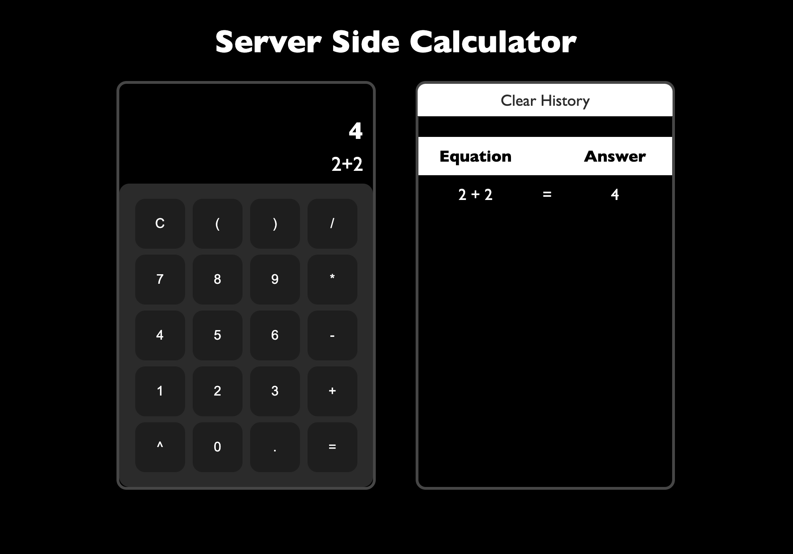

## Project Objective

The purpose of this project was to create a calculator app that operated on two values.

I ended up expanding on this idea, adding:

-   Order of operation
-   Parentheses
-   Exponents
-   Ability to add as many values / operations as the user wants

I also wanted to focus on having a seamless UI/UX experience for the user

## Features

User has the ability to:

-   Input a math expression and calculate it
-   See a history of expressions
-   Clear the history of expressions

## What I Learned

To do my calculations I had to use tons of regular expressions so I took a udemy course on it. I think regex is awesome 😄

Since I wanted to focus on design I spent tons of time learning about CSS and UI/UX design

## What I Would Add In The Future

There were limitations of my design, so I would improve the following:

-   Doesnt allow mutiplication through parens 2(3)
-   Doesnt allow decimals without 0 before them .1234
-   Cant evaluate negative numbers as the input is invalid if two operators are next to each other 3\*-1

## How To Run The Project

-   Run `npm install`
-   Run `npm start`

[Deployed Link 🚀](https://warm-fjord-74277.herokuapp.com/)

